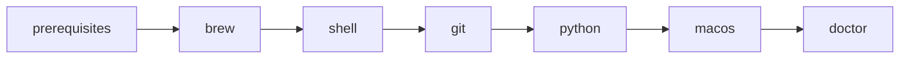

# Repository architecture

## Directory responsibilities

| Path | Role |
| --- | --- |
| `Makefile` | Human interface. Each target delegates to one script. |
| `Brewfile` | Declarative package layer. Placeholder in M00; populated in M01. |
| `scripts/` | Executable automation. Lint and test exist today; later milestones add installers and `doctor`. |
| `shell/` | Sourced Bash configuration (later milestone). Never sets strict-mode flags. |
| `git/` | Portable Git configuration (later milestone). |
| `docs/` | Manual setup that must not be automated (later milestone). |
| `knowledge/` | Durable architecture and decisions. Does not copy the roadmap. |

Directories are created only when they have content.

## Layering

Make is the entry point. Recipes contain no logic beyond invoking a script. Scripts call tools (`bash`, `brew`, `git`, `pyenv`). Humans run `make <target>`; agents do the same.

## Ownership boundaries

- **Repository:** tracked Brewfile, scripts, portable shell fragments, portable Git config, knowledge, and docs.
- **Machine-local files:** `~/.bashrc.local` and `~/.gitconfig.local` hold identity and host-specific values. They are not tracked.
- **User files we do not replace:** `~/.bashrc` and `~/.gitconfig`. The user adds a `source` line; Git uses `[include]`.
- **Manual steps:** brittle, proprietary, or security-sensitive setup stays in documentation.

## Constraints

- System `/bin/bash` is 3.2. No `globstar`, `mapfile`, associative arrays, or `${var,,}`.
- GNU Make is 3.81. No `.SHELLFLAGS`, `.ONESHELL`, `$(file ...)`, or `!=`.
- Never hard-code a Homebrew prefix. Use `brew --prefix` or `brew shellenv`.

## Eventual bootstrap sequence

This sequence is the target architecture. Only `help`, `lint`, and `test` are implemented in M00.

`bootstrap` will run that sequence and finish with `doctor`. `doctor` reports drift only; it does not mutate the machine.
